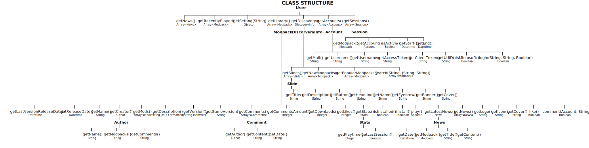

  

# UNIVERSE Launcher

This launcher was originally named matixs-mod-installer-rn


## Class Structure



## Project setup

```
yarn install
```

### Compiles and hot-reloads for development

```
yarn electron:serve
```

### Compiles and minifies for production

```
yarn electron:build
```

### Lints and fixes files

```
yarn lint
```

### Customize configuration

See [Configuration Reference](https://cli.vuejs.org/config/).
